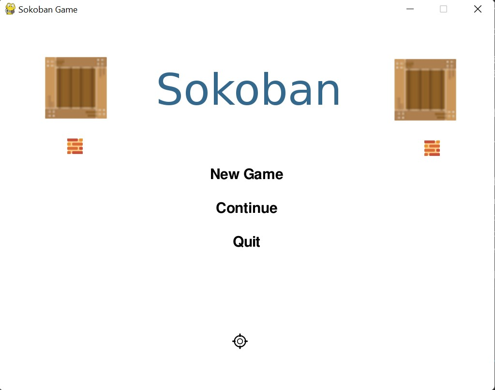
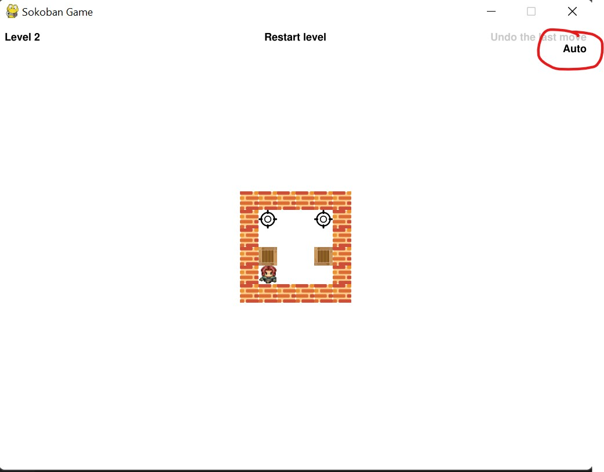
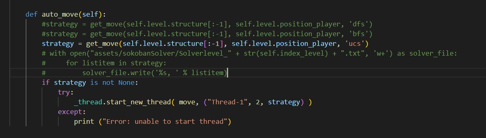
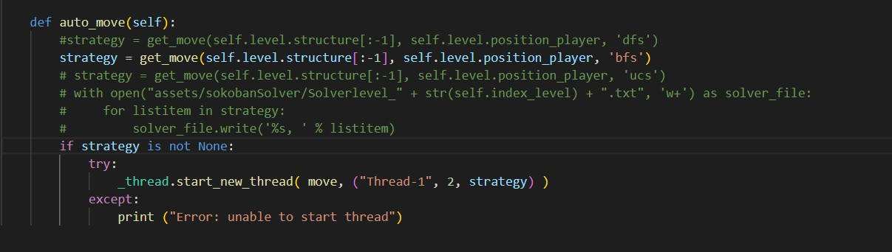

## Solve Game Sokoban with AI

Solve game Sokoban using Depth-First Search(DFS), Depth-First Search(BFS) and Uniform Cost Search(UCS)

### 1. Set up environment

```
pip install pygame
pip install pyautogui
```

### 2. How to run game

#### 2.1 Git clone source code
```
git clone https://github.com/UIT-20521888/Sokoban-AI.git
cd Sokoban-AI
```
#### 2.2 Run game
```
python3 Sokoban.py
```
- Then they will receive the main screen of the game as follows:

    
    
- Click "New Game" to play the game. Then the game screen will appear. So that the computer can solve the levels on its own using the algorithm we have chosen. Then we click on "Auto" in the game screen:

    

- After this step, the computer needs some calculation time to choose the path that leads to winning the game. And finally the computer will control the game character to follow the path found in the previous step.

- Note: The time to solve the levels is different, due to the difference in game space between levels.
### 3. How to change algorithm using?
- To change the running algorithm, you need to comment/uncomment the corresponding command lines in the auto_move() function in the game.py file.

- For example: 
    + We use the UCS algorithm to solve the game screen, then in the auto_move() function in the game.py file we need the comment and uncomment file as follows:

        
    
    + We use the BFS algorithm to solve the game screen, then in the auto_move() function in the game.py file we need the comment and uncomment file as follows:

        